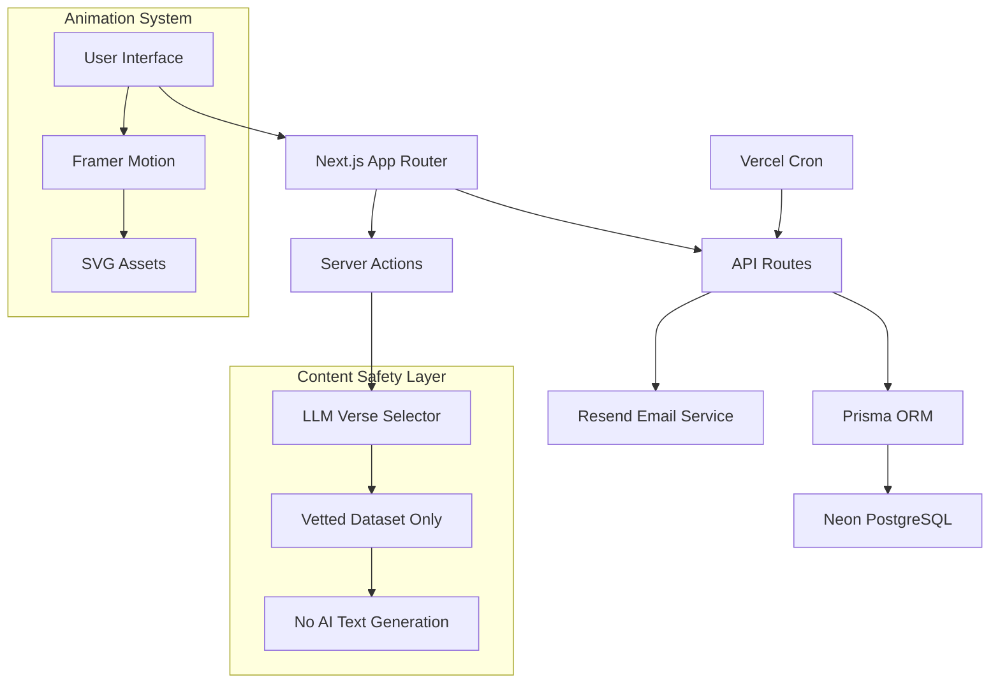

# Design Document

## Overview

Sukoon is a mobile-first Progressive Web Application built with Next.js 14 that delivers authentic Qur'an verses based on user mood selection. The application features a distinctive jar reveal animation, strict content authenticity protocols, and optional daily email subscriptions. The architecture prioritizes performance, accessibility, and spiritual content integrity.

## Architecture

### System Architecture



### Technology Stack

- **Frontend**: Next.js 14 (App Router), TypeScript, Tailwind CSS
- **Animation**: Framer Motion with SVG assets
- **Database**: Prisma ORM with Neon PostgreSQL
- **Email**: Resend API with double opt-in flow
- **Deployment**: Vercel with Cron jobs for daily emails
- **PWA**: Next.js PWA plugin with offline capabilities

## Components and Interfaces

### Core Components

#### 1. HeroJar Component

```typescript
interface HeroJarProps {
  selectedMood: string | null;
  onAnimationComplete: () => void;
  reducedMotion: boolean;
}

// Animation States: idle → chipSelected → lidOpening → slipRising → cardUnfold
```

#### 2. MoodChips Component

```typescript
interface MoodChipsProps {
  onMoodSelect: (mood: MoodType) => void;
  disabled: boolean;
}

type MoodType =
  | "happy"
  | "sad"
  | "angry"
  | "anxious"
  | "depressed"
  | "grateful";
```

#### 3. VerseCard Component

```typescript
interface VerseCardProps {
  verse: {
    id: string;
    surahNumber: number;
    ayahNumber: number;
    arabicText: string;
    translation: string;
    translatorName: string;
    audioUrl: string;
  };
  onReadComplete: () => void;
}
```

#### 4. PopupSubscribe Component

```typescript
interface PopupSubscribeProps {
  isOpen: boolean;
  onClose: () => void;
  onSubscribe: (email: string) => Promise<void>;
}
```

### Server Actions and API Routes

#### Server Actions

- `selectVerseForMood(mood: string)`: Calls LLM selector and returns full verse data
- `subscribeToDaily(email: string)`: Creates subscriber and sends confirmation email

#### API Routes

- `GET /api/verses?mood={mood}`: Returns candidate verse IDs with weights
- `POST /api/subscribe`: Handles email subscription
- `GET /api/confirm?token={token}`: Confirms email subscription
- `POST /api/cron/daily`: Daily email sender (Vercel Cron)

## Data Models

### Prisma Schema Design

```prisma
model Verse {
  id          String        @id
  surah       Int
  ayah        Int
  arabicText  String
  audioUrl    String?
  page        Int?
  hizb        Int?
  juz         Int?
  checksum    String
  translations Translation[]
  moodVerses  MoodVerse[]
  sendLogs    SendLog[]

  @@unique([surah, ayah])
}

model Translation {
  id           String     @id @default(cuid())
  verseId      String
  language     String
  translatorId String
  text         String
  verse        Verse      @relation(fields: [verseId], references: [id])
  translator   Translator @relation(fields: [translatorId], references: [id])

  @@unique([verseId, language, translatorId])
}

model Translator {
  id           String        @id @default(cuid())
  name         String
  license      String?
  sourceUrl    String?
  translations Translation[]
}

model Mood {
  id         String      @id @default(cuid())
  slug       String      @unique
  name       String
  colorHex   String
  moodVerses MoodVerse[]
}

model MoodVerse {
  id         String   @id @default(cuid())
  moodId     String
  verseId    String
  weight     Float
  reviewedAt DateTime @default(now())
  mood       Mood     @relation(fields: [moodId], references: [id])
  verse      Verse    @relation(fields: [verseId], references: [id])

  @@unique([moodId, verseId])
}

model Subscriber {
  id          String    @id @default(cuid())
  email       String    @unique
  confirmedAt DateTime?
  locale      String    @default("en")
  lastSentAt  DateTime?
  active      Boolean   @default(true)
  createdAt   DateTime  @default(now())
  sendLogs    SendLog[]
}

model SendLog {
  id           String     @id @default(cuid())
  subscriberId String
  verseId      String
  sentAt       DateTime   @default(now())
  subscriber   Subscriber @relation(fields: [subscriberId], references: [id])
  verse        Verse      @relation(fields: [verseId], references: [id])
}
```

### LLM Integration Design

#### Content Safety Protocol

1. **Input Sanitization**: Only verse IDs, weights, and metadata sent to LLM
2. **Output Validation**: Strict JSON schema validation for LLM responses
3. **Fallback Mechanisms**: Default verse selection if LLM fails
4. **Audit Trail**: All LLM interactions logged for review

#### Prompt System

- `prompts/system.md`: Core safety instructions
- `prompts/picker.md`: Mood-based verse selection logic
- `prompts/daily.md`: Daily newsletter verse selection
- `prompts/subject.md`: Email subject line generation (optional)

## Animation System Design

### Jar Reveal Animation Sequence

```typescript
const animationSequence = {
  idle: { duration: 0 },
  chipSelected: {
    chip: { scale: 0.95, opacity: 0.7 },
    duration: 100,
  },
  lidOpening: {
    lid: { rotate: 15, y: -6 },
    duration: 300,
    easing: "spring(220, 24)",
  },
  slipRising: {
    slip: { y: -40, scale: 1.06 },
    clipPath: "polygon(0 0, 100% 0, 100% 100%, 0 100%)",
    duration: 250,
  },
  cardUnfold: {
    card: { scale: [0.8, 1], opacity: [0, 1] },
    duration: 150,
  },
};
```

### Reduced Motion Support

- Detect `prefers-reduced-motion: reduce`
- Fallback: 0-50ms durations, no rotation transforms
- Maintain functionality while respecting accessibility preferences

## Email System Design

### Double Opt-in Flow

1. User enters email → temporary subscriber record created
2. Confirmation email sent with unique token
3. User clicks confirmation → `confirmedAt` timestamp set
4. Only confirmed subscribers receive daily emails

### Daily Email Logic

1. **Cron Trigger**: Vercel Cron at 6:00 AM UTC
2. **Subscriber Query**: Active, confirmed subscribers
3. **Verse Selection**: Exclude verses sent in last 30 days
4. **LLM Selection**: Use `prompts/daily.md` for personalized selection
5. **Email Rendering**: Arabic + translation + audio link + unsubscribe
6. **Logging**: Record all sends in SendLog table

### Email Template Structure

```html
<div dir="rtl" lang="ar" style="font-family: 'Amiri', serif; font-size: 24px;">
  {{ARABIC_TEXT}}
</div>
<div style="font-family: 'Inter', sans-serif; margin-top: 16px;">
  {{TRANSLATION}}
</div>
<div style="margin-top: 12px; font-size: 14px; color: #666;">
  — {{TRANSLATOR_NAME}}
</div>
```

## Error Handling

### Client-Side Error Boundaries

- React Error Boundaries for component failures
- Graceful fallbacks for animation failures
- Network error handling with retry mechanisms

### Server-Side Error Handling

- Database connection failures → fallback to cached data
- LLM API failures → default verse selection
- Email service failures → retry queue with exponential backoff
- Validation errors → user-friendly error messages

### Monitoring and Logging

- Structured logging for all critical operations
- Error tracking for LLM interactions
- Performance monitoring for animation sequences
- Email delivery status tracking

## Testing Strategy

### Unit Tests

- LLM output schema validation
- Verse selection logic
- Email template rendering
- Animation state transitions

### Integration Tests

- End-to-end mood selection flow
- Email subscription and confirmation flow
- Daily email sending process
- Database transaction integrity

### Accessibility Tests

- RTL text rendering validation
- Keyboard navigation testing
- Screen reader compatibility
- Color contrast verification
- Reduced motion preference handling

### Performance Tests

- Animation performance on low-end devices
- Database query optimization
- Bundle size optimization
- Lighthouse score validation (≥90 for PWA, Performance, Accessibility)

## Security Considerations

### Content Security

- Strict CSP headers to prevent XSS
- Input validation for all user data
- SQL injection prevention via Prisma
- Rate limiting for API endpoints

### Email Security

- Double opt-in to prevent spam
- Unsubscribe token validation
- Email address validation and sanitization
- DKIM/SPF configuration for deliverability

### Data Privacy

- Minimal data collection (email only)
- GDPR-compliant data handling
- Secure token generation for confirmations
- Regular data cleanup for inactive subscribers

## Deployment Architecture

### Vercel Configuration

- Next.js 14 App Router deployment
- Edge functions for API routes
- Cron jobs for daily email sending
- Environment variable management

### Database Setup

- Neon PostgreSQL with connection pooling
- Separate direct URL for migrations
- Automated backups and point-in-time recovery
- Read replicas for improved performance

### CDN and Assets

- Vercel Edge Network for global distribution
- Optimized SVG assets for animations
- Font optimization for Arabic typography
- Progressive image loading for better performance
